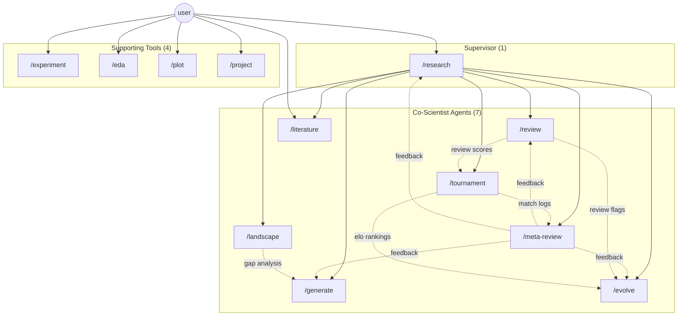

# Skill Graph

Dependency map and data-flow documentation for all 12 co-scientist skills.

## Mermaid Diagram

## Vault I/O Table

| Skill | Reads From | Writes To |
|---|---|---|
| `/research` | `_research/goals/`, `_research/hypotheses/_index.md`, `_research/meta-reviews/` | `_research/goals/` |
| `/generate` | `_research/goals/`, `_research/meta-reviews/`, `_research/landscape/`, `_research/hypotheses/` | `_research/hypotheses/`, `_research/hypotheses/_index.md` |
| `/review` | `_research/hypotheses/`, `_research/meta-reviews/` | `_research/hypotheses/` (frontmatter: review_scores, review_flags, Review History) |
| `/tournament` | `_research/hypotheses/`, `_research/goals/` | `_research/tournaments/`, `_research/hypotheses/` (frontmatter: elo, matches, wins, losses), `_research/hypotheses/_index.md` |
| `/evolve` | `_research/hypotheses/`, `_research/meta-reviews/` | `_research/hypotheses/` (new generation notes), `_research/hypotheses/_index.md` |
| `/landscape` | `_research/hypotheses/` | `_research/landscape/`, `_research/landscape.md` |
| `/meta-review` | `_research/tournaments/`, `_research/hypotheses/` (review histories) | `_research/meta-reviews/` |
| `/literature` | Configured search backends (see `literature:` in config) | `_research/literature/`, `_research/literature/_index.md` |
| `/experiment` | `_research/hypotheses/` (linked hypothesis) | `_research/experiments/`, `_research/experiments/_index.md`, `_research/hypotheses/` (frontmatter: linked_experiments) |
| `/eda` | user-provided dataset | `_research/eda-reports/`, `_research/eda-reports/_index.md` |
| `/plot` | user-provided data, `_code/styles/STYLE_GUIDE.md`, `_code/styles/PLOT_DESIGN.md`, profile `styles/PLOT_DESIGN.md` | user-specified output directory (PDF figures) |
| `/project` | `projects/`, `projects/_index.md`, filesystem (project detection) | `projects/`, `projects/_index.md` |

## Skill Tiers

### Tier 1: Supervisor (1)
The orchestrator that drives the generate-debate-evolve loop and delegates to all co-scientist agents.

| Skill | Role |
|---|---|
| `/research` | Supervisor / orchestrator -- selects next method step based on current knowledge state |

### Tier 2: Co-Scientist Agents (7)
Leaf agents invoked by `/research` to execute specific steps in the scientific method loop.

| Skill | Role |
|---|---|
| `/generate` | Abductive inference -- proposes novel hypotheses |
| `/review` | Deductive verification -- peer review of hypothesis quality |
| `/tournament` | Competitive falsification -- pairwise Elo-ranked debate |
| `/evolve` | Theory refinement -- synthesizes and improves hypotheses |
| `/landscape` | Inductive gap analysis -- clusters and maps hypothesis space |
| `/meta-review` | Second-order learning -- extracts patterns for self-improvement |
| `/literature` | Evidence gathering -- systematic literature search |

### Tier 3: Supporting Tools (4)
Standalone utilities invoked directly by the user for data work, visualization, experiments, and project management.

| Skill | Role |
|---|---|
| `/experiment` | Experimental design and provenance logging |
| `/eda` | Exploratory data analysis with PII redaction |
| `/plot` | Publication-quality figure generation |
| `/project` | Research project registry management |
